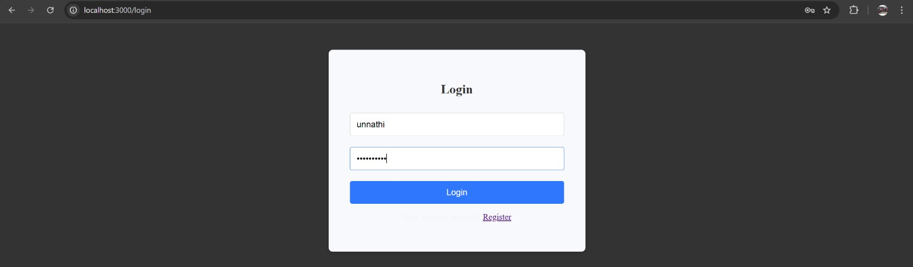
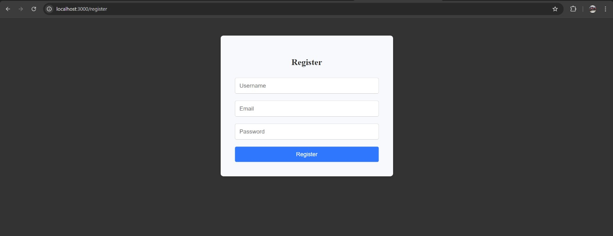
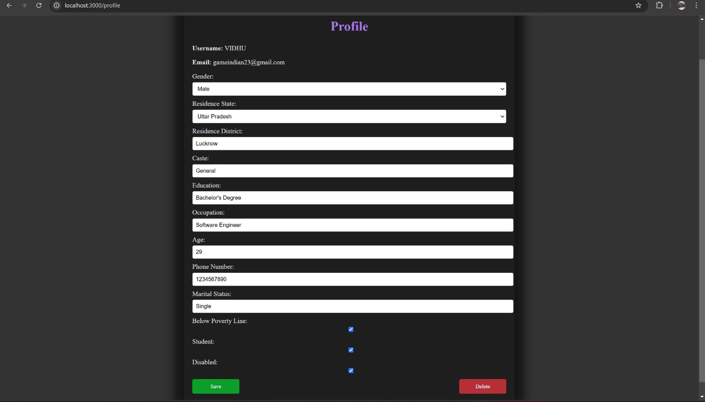
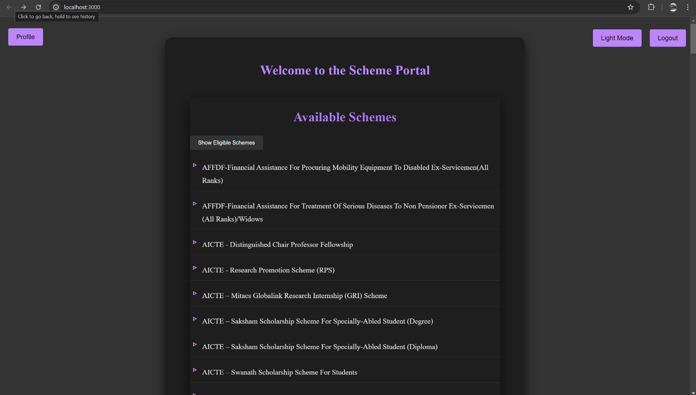
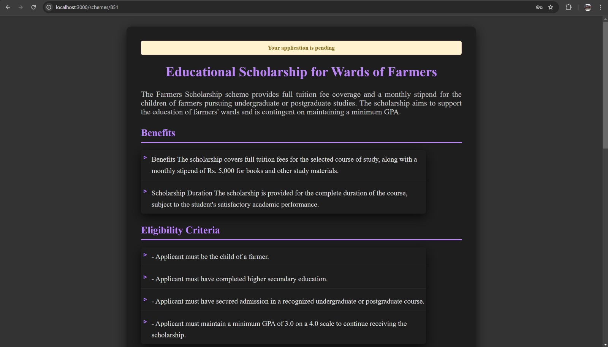
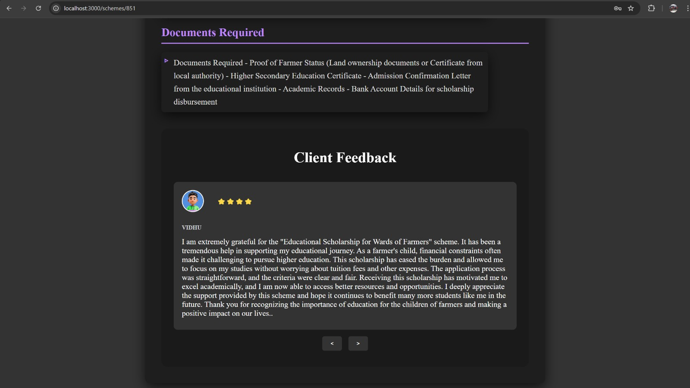
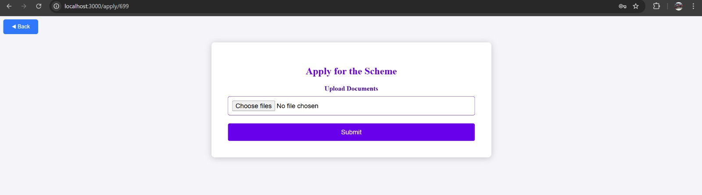
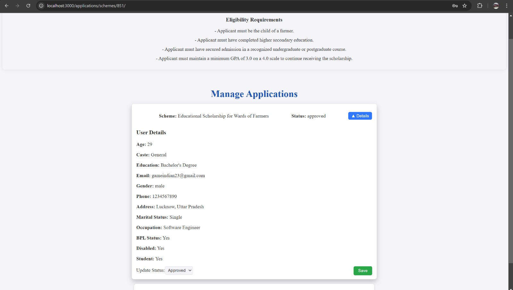

# Government Scheme Management System

An intelligent, user-focused platform that personalizes the discovery and application of government schemes based on individual profiles. Built with **Django (Python)**, **React.js**, and **MySQL**, this system empowers users to find, assess, and apply for government programs they’re eligible for—while enabling administrators to manage schemes and application workflows.

---

## 🚀 Features

### 👤 User-Facing
- **Profile-Based Recommendations**: Tailored schemes based on caste, gender, age, education, occupation, income, and physical ability.
- **Scheme Explorer**: Filter and browse relevant government programs by category and eligibility.
- **In-Depth Scheme Details**: Each listing includes eligibility, benefits, required documents, deadlines, and public reviews.
- **Application Portal**: Users can directly apply by uploading supporting documents.
- **Email Notifications**: Receive real-time updates on application status or scheme updates.

### 🛠️ Admin Panel
- **Scheme Dashboard**: View, add, update, or delete government schemes.
- **Application Review**: Inspect applicant profiles and documents. Approve/reject applications with one click.
- **Notification System**: Automatically notify users via email of approval, rejection, or changes to scheme details.

---

## 🧱 Tech Stack

| Layer         | Technology                         |
|--------------|-------------------------------------|
| Frontend     | React.js                            |
| Backend      | Django (Python)                     |
| Database     | MySQL                               |
| Auth         | Django Auth                         |
| Email Service| Django Email Backend (SMTP)         |

---

## 🖼️ Screenshots

### 🧭 User Workflow

| Login Page | Register Page |
|------------|---------------|
|  |  |

| Profile Page | Home Page |
|--------------|-----------|
|  |  |

| Scheme Details | Submit Feedback |
|----------------|-----------------|
|  |  |

| Apply to Scheme |
|-----------------|
|  |

---

### 🛡️ Admin Panel

| Manage Applications |
|---------------------|
|  |

---

## ⚙️ How to Run Locally

```bash
# Backend
cd scheme_portal/
python -m venv env
source env/bin/activate
pip install -r requirements.txt
python manage.py makemigrations
python manage.py migrate
python manage.py runserver
```

```bash
# Frontend
cd frontend/SchemeExplorerUI
npm install
npm run dev
```

---

## 🛡️ Future Enhancements

- AI-based scheme matching engine
- Mobile-friendly interface

---

## ⭐ Why This Project?

This project was developed to bridge the gap between citizens and the myriad of government assistance programs. With complex eligibility and scattered access points, many individuals miss out on schemes they truly qualify for. This portal changes that.
```
